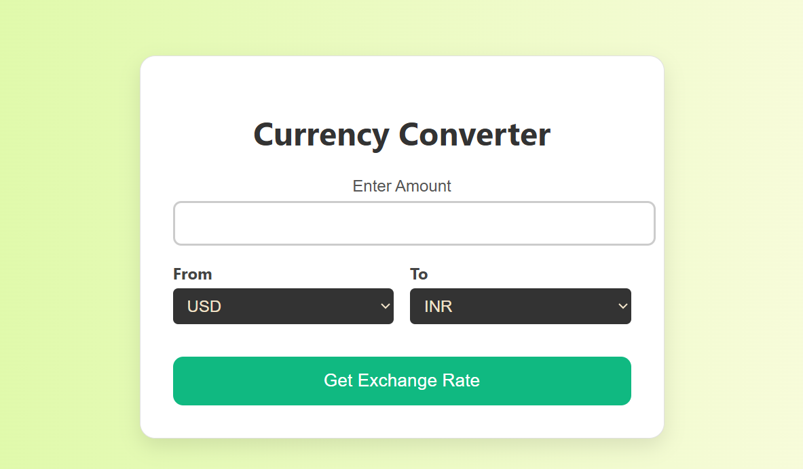

# 💱 Currency Converter

A sleek and simple web-based currency converter that allows users to get real-time exchange rates and convert amounts between different currencies.

## 🚀 Features

- 🌍 Convert between any two currencies
- 🔄 Live exchange rate fetching
- 💡 Intuitive and responsive UI
- 🎨 Clean gradient background with a modern design

## 🛠️ Built With

- HTML
- CSS
- JavaScript
- [ExchangeRate API](https://www.exchangerate-api.com/)

## 📸 Preview

## 📁 Project Structure
currency-converter/
├── Currency Converter.html
├── Currency Converter.css
├── Currency Converter.js
├── screenshot.png
└── README.md

### ❤️ Made with love by **Vivaan Garg**

